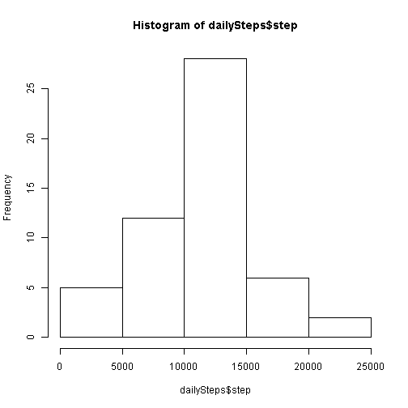
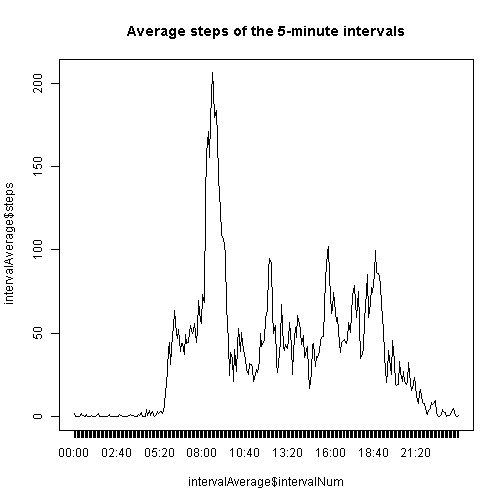
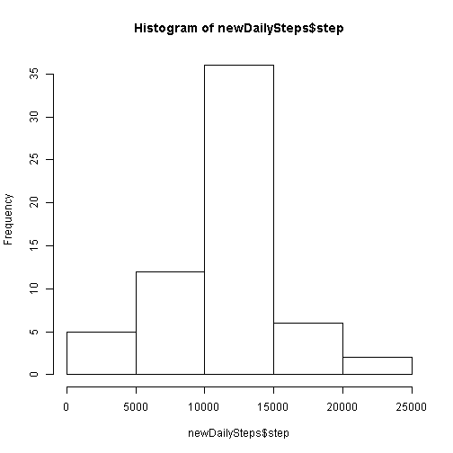
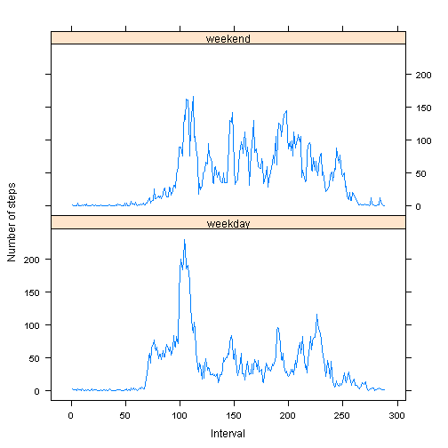

<<setup, echo=TRUE, cache=FALSE>>=

Reproducible Research Course Peer Assessment 1
=========================

Loading and preprocessing the data
-------------------------

Show any code that is needed to

### Load the data (i.e. read.csv())

```r
myFile <- "./activity.csv"
activityData <- read.csv(myFile, header = TRUE, sep = ",", quote = "\"")
```

### Process/transform the data (if necessary) into a format suitable for your analysis

```r
# intervalNum is from 1 to 288 for each day
activityData$intervalNum <- (activityData$interval%/%100) * 12 + (activityData$interval%%100)/5 + 
    1
# interval is transformed to HH:MM time formatted String now
activityData$interval <- format(strptime(sprintf("%04d", activityData$interval), 
    format = "%H%M"), format = "%H:%M")
# datetime combines date and time
activityData$datetime <- strptime(paste(activityData$date, activityData$interval, 
    sep = " "), "%Y-%m-%d %H:%M")
# date is formatted as Date type
activityData$date <- as.Date(activityData$date, format = "%Y-%m-%d")
```


What is mean total number of steps taken per day?
-------------------------

For this part of the assignment, you can ignore the missing values in the dataset.

### Make a histogram of the total number of steps taken each day

```r
dailySteps <- aggregate(steps ~ date, activityData, sum)
hist(dailySteps$step)
```

 

### Calculate and report the mean and median total number of steps taken per day

```r
dailyMeanSteps <- mean(dailySteps$step, na.rm = TRUE)
print(sprintf("Daily mean steps = %f", dailyMeanSteps))
```

```
## [1] "Daily mean steps = 10766.188679"
```

```r
dailyMedianSteps <- median(dailySteps$step, na.rm = TRUE)
print(sprintf("Daily median steps = %f", dailyMedianSteps))
```

```
## [1] "Daily median steps = 10765.000000"
```


What is the average daily activity pattern?
-------------------------

### Make a time series plot (i.e. type = "l") of the 5-minute interval (x-axis) and the average number of steps taken, averaged across all days (y-axis)


```r
intervalAverage <- aggregate(steps ~ intervalNum, activityData, mean)
plot(intervalAverage$intervalNum, intervalAverage$steps, type = "l", main = "Average steps of the 5-minute intervals", 
    xaxt = "n")
axis(1, at = intervalAverage$intervalNum, labels = activityData$interval[1:length(intervalAverage$intervalNum)])
```

 


### Which 5-minute interval, on average across all the days in the dataset, contains the maximum number of steps?


```r
maxIntervalAverage <- max(intervalAverage$steps)
print(sprintf("Max interval average steps = %f", maxIntervalAverage))
```

```
## [1] "Max interval average steps = 206.169811"
```

```r
intervalNumMax <- which(maxIntervalAverage == intervalAverage$steps)
print(sprintf("Interval # of the max interval average steps = %d", intervalNumMax))
```

```
## [1] "Interval # of the max interval average steps = 104"
```

```r
intervalMax <- activityData$interval[intervalNumMax]
print(sprintf("Interval time of the max interval average steps = %s", intervalMax))
```

```
## [1] "Interval time of the max interval average steps = 08:35"
```


Imputing missing values
-------------------------

Note that there are a number of days/intervals where there are missing values (coded as NA). The presence of missing days may introduce bias into some calculations or summaries of the data.

### Calculate and report the total number of missing values in the dataset (i.e. the total number of rows with NAs)


```r
totalNumOfMissingValues <- length(which(is.na(activityData$steps)))
print(sprintf("Total number of missing values is %s", totalNumOfMissingValues))
```

```
## [1] "Total number of missing values is 2304"
```


### Devise a strategy for filling in all of the missing values in the dataset. The strategy does not need to be sophisticated. For example, you could use the mean/median for that day, or the mean for that 5-minute interval, etc.

The mean for that 5-minute interval, which is stored in __intervalAverage__, is used to fill in missing values.

### Create a new dataset that is equal to the original dataset but with the missing data filled in.


```r
newActivityData <- activityData
for (i in which(is.na(newActivityData$steps))) {
    newActivityData$steps[i] <- intervalAverage$steps[newActivityData$intervalNum[i]]
}
```


### Make a histogram of the total number of steps taken each day and Calculate and report the mean and median total number of steps taken per day. Do these values differ from the estimates from the first part of the assignment? What is the impact of imputing missing data on the estimates of the total daily number of steps?


```r
newDailySteps <- aggregate(steps ~ date, newActivityData, sum)
hist(newDailySteps$step)
```

 

```r
newDailyMeanSteps <- mean(newDailySteps$step)
print(sprintf("New daily mean steps = %f", newDailyMeanSteps))
```

```
## [1] "New daily mean steps = 10766.188679"
```

```r
newDailyMedianSteps <- median(newDailySteps$step)
print(sprintf("New daily median steps = %f", newDailyMedianSteps))
```

```
## [1] "New daily median steps = 10766.188679"
```


Because missing steps values are filled in with average value for that interval, the total number of steps taken per day increased, the histogram shows the percentage of 10000 ~ 15000 average steps per day increased from around 25% to 35%.

The mean total number of steps taken per day does not change, it is still 10766.188679.

The median total number of steps taken per day changes from 10765.000000 to 10766.188679.

Are there differences in activity patterns between weekdays and weekends?
-------------------------

For this part the weekdays() function may be of some help here. Use the dataset with the filled-in missing values for this part.

### Create a new factor variable in the dataset with two levels - "weekday" and "weekend" indicating whether a given date is a weekday or weekend day.


```r
newActivityData$dayType <- 1
newActivityData$dayType[which(weekdays(newActivityData$date) == "Saturday")] <- 2
newActivityData$dayType[which(weekdays(newActivityData$date) == "Sunday")] <- 2

intervalAverageByDayType <- aggregate(steps ~ dayType + intervalNum, newActivityData, 
    mean)
intervalAverageByDayType$dayType.f <- factor(intervalAverageByDayType$dayType, 
    levels = c(1, 2), labels = c("weekday", "weekend"))
```


### Make a panel plot containing a time series plot (i.e. type = "l") of the 5-minute interval (x-axis) and the average number of steps taken, averaged across all weekday days or weekend days (y-axis). The plot should look something like the following, which was creating using simulated data:


```r
library(lattice)
xyplot(intervalAverageByDayType$steps ~ intervalAverageByDayType$intervalNum | 
    intervalAverageByDayType$dayType.f, type = "l", ylab = "Number of steps", 
    xlab = "Interval", layout = c(1, 2))
```

 


From the panel plot, there are obvious differences in activity patterns between weekdays and weekends:
1. Weekend's average steps are kind of flat, compared with those of weekdays, from morning to night.
2. Weekday has highest average steps in the morning, and much less steps after that through the day.
Maybe because he/she exercised in weekday mornings. 
